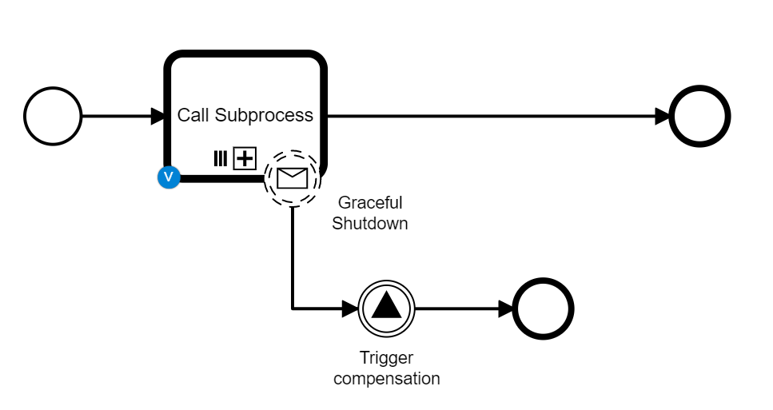
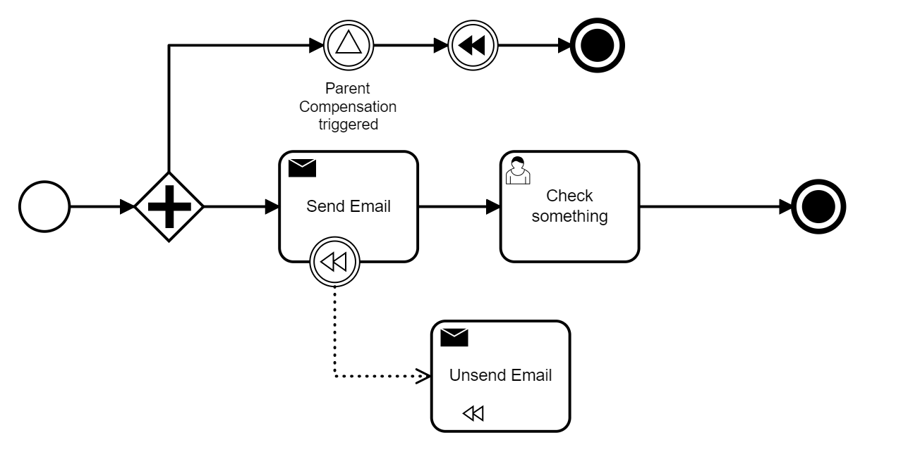
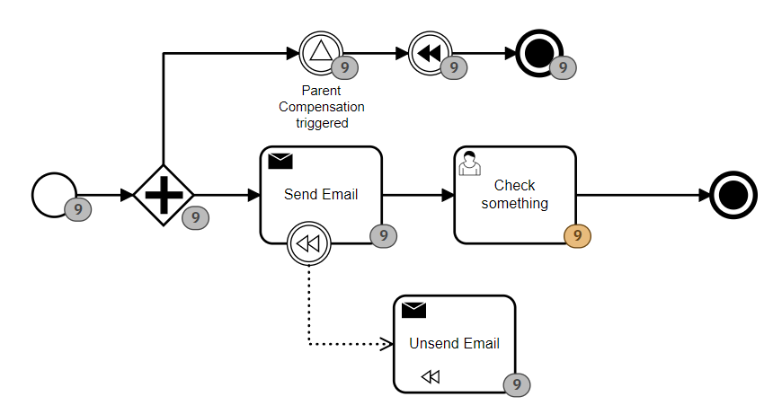

# Compensation of Multi-Instance Subprocess (Example)

In this example there are two BPMN processes. A parent and a child.

The parent process uses a Call Activity to call multiple instances of a child processes.
It also waits for a ``Graceful Shutdown`` message which should trigger the process to compensate any completed tasks in the sub process while canceling the currently running instances. This is done by sending a Signal event which is caught by all active sub processes

The child process executes a ``Send Email`` task while also waiting for a signal that might come in from the parent process. If that signal does come in the compensation will be triggered and once that has been successfully compensated the sub process will end.

After it's been run the history of the process will look like this - in which gray numbers being taks that hav ebeen executed and orange where they have been canceled.

